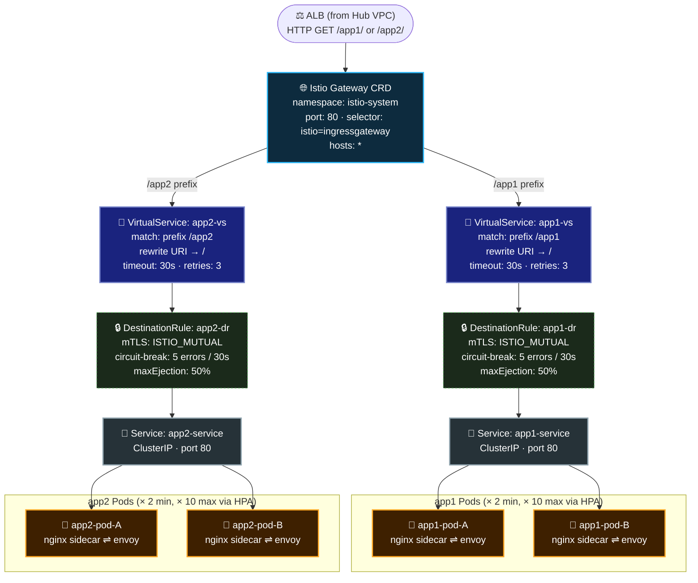

# AWS Hub-and-Spoke EKS — Enterprise DevSecOps Assessment

[](https://www.terraform.io/)
[](https://kubernetes.io/)
[](https://istio.io/)
[](https://helm.sh/)
[](https://azure.microsoft.com/en-us/products/devops/)
[](https://github.com/gitleaks/gitleaks)

---

## Executive Summary

This repository delivers a **production-grade, enterprise DevSecOps** solution for an AWS Hub-and-Spoke network topology assessment. The architecture implements a **zero-trust, defense-in-depth** network design where workloads in a private EKS cluster are reachable only through a controlled, observable traffic path — never directly from the internet.

| Layer | Technology | Purpose |
|---|---|---|
| **Edge / Ingress** | AWS ALB (Hub VPC) | Internet-facing entry point, TLS termination |
| **Network Fabric** | AWS Transit Gateway | Secure cross-VPC routing (Hub ↔ Spoke) |
| **Container Platform** | Amazon EKS 1.29 | Managed Kubernetes in private Spoke VPC |
| **Service Mesh** | Istio 1.21 | mTLS, traffic management, observability |
| **App Delivery** | Helm 3 | Versioned, templated microservice deployments |
| **IaC** | Terraform 1.8 (official modules) | Reproducible, auditable infrastructure |
| **CI/CD** | Azure DevOps YAML Pipelines | Gated, automated delivery |
| **Security Scanning** | Gitleaks + tfsec | Shift-left secrets detection + SAST |

---

## Architecture Diagrams

> Three focused diagrams are provided below — each explaining a different layer of the system.

---

### Diagram 1 — Network Topology (End-to-End Traffic Flow)

```mermaid
flowchart LR
    %% ── Styles ──────────────────────────────────────────────────────────────
    classDef internet  fill:#1a1a2e,stroke:#e94560,color:#fff,stroke-width:2px
    classDef hubvpc    fill:#1e3a5f,stroke:#4da6ff,color:#fff,stroke-width:2px
    classDef tgw       fill:#3b1f6e,stroke:#b68fff,color:#fff,stroke-width:2px
    classDef spokevpc  fill:#1a3a2a,stroke:#4caf82,color:#fff,stroke-width:2px
    classDef eks       fill:#0f2a1a,stroke:#66bb6a,color:#fff,stroke-width:2px
    classDef istio     fill:#0d2b3e,stroke:#29b6f6,color:#fff,stroke-width:2px
    classDef pod       fill:#3e2000,stroke:#ffa726,color:#fff,stroke-width:2px
    classDef sg        fill:#4a1010,stroke:#ef5350,color:#fff,stroke-width:1px,stroke-dasharray:4

    %% ── Nodes ───────────────────────────────────────────────────────────────
    USER(["👤 Internet User"])

    subgraph HUB["🌐  Hub VPC — 10.0.0.0/16"]
        IGW["🔌 Internet\nGateway"]
        ALB_SG["🛡️ ALB Security Group\n✅ 0.0.0.0/0 → 80, 443\n❌ all other ports blocked"]
        ALB["⚖️ Application Load\nBalancer\nport 80 / 443"]
    end

    subgraph TGW_BOX["🔀  AWS Transit Gateway"]
        TGW["Transit Gateway\nASN 64512"]
        RT_HUB["📋 RT: Hub\nlearns Spoke 10.1.0.0/16"]
        RT_SPOKE["📋 RT: Spoke\nlearns Hub 10.0.0.0/16"]
    end

    subgraph SPOKE["🔒  Spoke VPC — 10.1.0.0/16  ❌ No IGW · No NAT"]
        NODE_SG["🛡️ Node Security Group\n✅ ONLY Hub CIDR 10.0.0.0/16\n❌ No internet ingress"]

        subgraph CLUSTER["☸️  Amazon EKS Cluster"]
            ISTIO_GW["🌐 Istio Ingress\nGateway\nport 80/443"]
            VS["🔀 Istio VirtualService\n/app1 → app1-svc\n/app2 → app2-svc"]
            APP1["🐳 app1 Pods\nnginx:1.27-alpine\n× 2 replicas"]
            APP2["🐳 app2 Pods\nnginx:1.27-alpine\n× 2 replicas"]
        end
    end

    %% ── Traffic Flow ─────────────────────────────────────────────────────────
    USER       -->|"① HTTP/HTTPS"| IGW
    IGW        -->|"② hits SG"| ALB_SG
    ALB_SG     -->|"③ allowed"| ALB
    ALB        -->|"④ IP target\n10.1.x.x"| TGW
    TGW        --- RT_HUB
    TGW        --- RT_SPOKE
    RT_SPOKE   -->|"⑤ route\n10.1.0.0/16"| NODE_SG
    NODE_SG    -->|"⑥ allowed\n(Hub CIDR)"| ISTIO_GW
    ISTIO_GW   -->|"⑦ Gateway CRD\nmatch all hosts"| VS
    VS         -->|"⑧ /app1"| APP1
    VS         -->|"⑧ /app2"| APP2

    %% ── Apply styles ─────────────────────────────────────────────────────────
    class USER internet
    class IGW,ALB_SG,ALB hubvpc
    class TGW,RT_HUB,RT_SPOKE tgw
    class NODE_SG sg
    class ISTIO_GW istio
    class VS istio
    class APP1,APP2 pod
```



---

### Diagram 2 — Istio Service Mesh Routing Detail



---

### Diagram 3 — CI/CD Pipeline Flow (Azure DevOps)

```mermaid
flowchart TD
    classDef trigger fill:#1a1a2e,stroke:#e94560,color:#fff,stroke-width:2px
    classDef scan    fill:#4a1010,stroke:#ef5350,color:#fff,stroke-width:2px
    classDef tf      fill:#3b1f6e,stroke:#b68fff,color:#fff,stroke-width:2px
    classDef deploy  fill:#1e3a5f,stroke:#4da6ff,color:#fff,stroke-width:2px
    classDef gate    fill:#3e2000,stroke:#ffa726,color:#fff,stroke-width:3px
    classDef smoke   fill:#1a3a2a,stroke:#4caf82,color:#fff,stroke-width:2px
    classDef fail    fill:#4a1010,stroke:#ef5350,color:#fff,stroke-width:2px,stroke-dasharray:5

    %% ════════════════════════════════════════════════
    %% PIPELINE 1 — TERRAFORM
    %% ════════════════════════════════════════════════

    subgraph TF_PIPE["📦  Pipeline 1 — terraform-ci-cd.yaml  (triggers on terraform/**)"]
        T0(["🔀 Git Push\nfeature/* or main"])
        T1["🔐 Gitleaks\nSecrets Scan\n.gitleaks.toml"]
        T2["🔍 tfsec\nTerraform SAST\nMIN severity: HIGH"]
        T3["✅ terraform fmt\n+ validate\n-backend=false"]
        T4["📋 terraform plan\n-out=tfplan artifact\nS3 backend init"]
        T5{{"🔑 APPROVAL GATE\nmanual review\n(main branch only)"}}
        T6["🚀 terraform apply\n-auto-approve\n-input=false"]
        T7["📤 Publish Outputs\ntf-outputs.json artifact"]
        T_FAIL(["❌ Pipeline BLOCKED\nsecurity issue found"])

        T0 --> T1 & T2
        T1 -->|"clean"| T3
        T2 -->|"no HIGH findings"| T3
        T1 -->|"secrets found"| T_FAIL
        T2 -->|"HIGH+ found"| T_FAIL
        T3 --> T4
        T4 --> T5
        T5 -->|"✅ approved"| T6
        T5 -->|"❌ rejected"| T_FAIL
        T6 --> T7
    end

    %% ════════════════════════════════════════════════
    %% PIPELINE 2 — APP DEPLOY
    %% ════════════════════════════════════════════════

    subgraph APP_PIPE["🚢  Pipeline 2 — app-ci-cd.yaml  (triggers on kubernetes/**)"]
        A0(["🔀 Git Push\nkubernetes/**"])
        A1["🔐 Gitleaks\nSecrets Scan"]
        A2["🧹 helm lint\nmicroservice chart\n--strict"]
        A3["📡 kubectl apply\ngateway.yaml\nvirtualservice.yaml"]
        A4["📦 helm diff\napp1 (drift check)"]
        A5["🚀 helm upgrade\n--install app1\n--atomic --wait"]
        A6["📦 helm diff\napp2 (drift check)"]
        A7["🚀 helm upgrade\n--install app2\n--atomic --wait"]
        A8["🧪 Smoke Test\ncurl /app1 + /app2\n5 retries × 15s"]
        A_FAIL(["❌ Pipeline BLOCKED"])

        A0 --> A1 & A2
        A1 -->|"clean"| A3
        A2 -->|"lint OK"| A3
        A1 -->|"secrets"| A_FAIL
        A2 -->|"lint fail"| A_FAIL
        A3 --> A4 --> A5
        A5 --> A6 --> A7
        A7 --> A8
        A8 -->|"200 OK"| DONE(["✅ Deployment\nSuccessful"])
        A8 -->|"failed"| A_FAIL
    end

    class T0,A0 trigger
    class T1,T2,A1,A2 scan
    class T3,T4,T6,T7 tf
    class A3,A4,A5,A6,A7 deploy
    class T5 gate
    class A8,DONE smoke
    class T_FAIL,A_FAIL fail
```



---

### Traffic Flow (Step-by-Step)

| Step | From | To | Protocol / Port | Security Check |
|---|---|---|---|---|
| ① | Internet User | Internet Gateway | HTTP/HTTPS | — |
| ② | IGW | ALB Security Group | TCP 80, 443 | SG allows `0.0.0.0/0` |
| ③ | ALB SG | ALB (Hub VPC) | TCP 80, 443 | Implicit allow |
| ④ | ALB | TGW (IP target) | TCP 80 | Route table `10.1.0.0/16 → TGW` |
| ⑤ | TGW | EKS Node SG | TCP 80 | RT propagation Hub↔Spoke |
| ⑥ | Node SG | Istio Ingress GW | TCP 80 | SG: Hub CIDR only `10.0.0.0/16` |
| ⑦ | Istio GW | VirtualService | Internal | Gateway CRD match `hosts: *` |
| ⑧ | VirtualService | app1 / app2 Pods | mTLS / TCP | DestinationRule `ISTIO_MUTUAL` |

---


## Repository Structure

```
aws-hub-spoke-eks-assessment/
├── .gitleaks.toml                          # Secrets scanning configuration
├── README.md                               # This document
│
├── terraform/
│   ├── main.tf                             # Hub VPC, Spoke VPC, TGW, route tables
│   ├── alb.tf                              # Internet-facing ALB, security groups
│   ├── eks.tf                              # EKS cluster, node groups, VPC endpoints
│   ├── variables.tf                        # All input variables
│   └── outputs.tf                          # Key outputs (ALB DNS, cluster endpoint)
│
├── kubernetes/
│   ├── istio/
│   │   ├── gateway.yaml                    # Istio Gateway CRD (port 80/443)
│   │   └── virtualservice.yaml             # VirtualService + DestinationRules
│   └── helm/
│       └── microservice/                   # Generic Helm chart (app1 & app2)
│           ├── Chart.yaml
│           ├── values.yaml
│           └── templates/
│               ├── deployment.yaml         # Nginx + probes + security context
│               ├── service.yaml            # ClusterIP service
│               ├── hpa.yaml                # HorizontalPodAutoscaler
│               ├── pdb.yaml                # PodDisruptionBudget
│               ├── resourcequota.yaml      # ResourceQuota + LimitRange
│               └── configmap.yaml          # Nginx config with security headers
│
└── pipelines/
    ├── terraform-ci-cd.yaml                # ADO: IaC pipeline (validate → plan → apply)
    └── app-ci-cd.yaml                      # ADO: App pipeline (scan → deploy → test)
```

---

## Security Boundaries Matrix

| Component | Boundary | Enforcement |
|---|---|---|
| **ALB Security Group** | Allows `0.0.0.0/0 → 80, 443` | AWS Security Group |
| **ALB Security Group** | Denies all other inbound | Implicit deny |
| **TGW Route Table (Hub)** | Only routes to Spoke CIDR | Explicit route table |
| **TGW Route Table (Spoke)** | Only routes to Hub CIDR | Explicit route table |
| **EKS Node Security Group** | Allows ingress **only** from Hub VPC CIDR `10.0.0.0/16` | AWS Security Group |
| **EKS Node Security Group** | Node-to-node: self-reference only | AWS Security Group |
| **Istio mTLS** | All pod-to-pod traffic encrypted | DestinationRule `ISTIO_MUTUAL` |
| **Namespace ResourceQuota** | CPU/Memory caps, max 20 pods | Kubernetes ResourceQuota |
| **Container Security Context** | `allowPrivilegeEscalation: false` | Kubernetes SecurityContext |
| **Gitleaks** | Blocks commits with embedded secrets | Pre-pipeline scan |
| **tfsec** | Blocks HIGH+ severity IaC findings | Pipeline security stage |

---

## Prerequisites

| Tool | Minimum Version | Install |
|---|---|---|
| Terraform | 1.8.x | [terraform.io](https://www.terraform.io/downloads) |
| AWS CLI | 2.x | [aws.amazon.com/cli](https://aws.amazon.com/cli/) |
| kubectl | 1.29.x | [kubernetes.io](https://kubernetes.io/docs/tasks/tools/) |
| Helm | 3.14.x | [helm.sh](https://helm.sh/docs/intro/install/) |
| istioctl | 1.21.x | [istio.io](https://istio.io/latest/docs/setup/getting-started/) |

---

## Deployment Guide

### Step 1 — AWS Credentials

```bash
export AWS_ACCESS_KEY_ID="your-access-key-id"
export AWS_SECRET_ACCESS_KEY="your-secret-access-key"
export AWS_DEFAULT_REGION="ap-southeast-1"
```

### Step 2 — Deploy Infrastructure (Terraform)

```bash
cd terraform/

# Initialise with remote backend (S3 + DynamoDB)
terraform init \
  -backend-config="bucket=your-tf-state-bucket" \
  -backend-config="key=hub-spoke/terraform.tfstate" \
  -backend-config="region=ap-southeast-1"

# Review plan
terraform plan -var="aws_region=ap-southeast-1"

# Apply
terraform apply -var="aws_region=ap-southeast-1" -auto-approve

# Capture outputs
terraform output
```

### Step 3 — Configure kubectl

```bash
# Output from terraform
aws eks update-kubeconfig \
  --region ap-southeast-1 \
  --name hubspoke-eks-cluster
```

### Step 4 — Install Istio

```bash
# Download istioctl
curl -L https://istio.io/downloadIstio | ISTIO_VERSION=1.21.0 sh -
export PATH="$PWD/istio-1.21.0/bin:$PATH"

# Install Istio with default profile
istioctl install --set profile=default -y

# Enable automatic sidecar injection in the default namespace
kubectl label namespace default istio-injection=enabled
```

### Step 5 — Apply Istio Gateway & VirtualService

```bash
kubectl apply -f kubernetes/istio/gateway.yaml
kubectl apply -f kubernetes/istio/virtualservice.yaml

# Verify
kubectl get gateway -n istio-system
kubectl get virtualservice -n default
kubectl get destinationrule -n default
```

### Step 6 — Deploy Microservices via Helm

```bash
# Deploy app1
helm upgrade --install app1 kubernetes/helm/microservice \
  --namespace default \
  --set appName=app1 \
  --set image.tag=1.27.0-alpine \
  --wait

# Deploy app2
helm upgrade --install app2 kubernetes/helm/microservice \
  --namespace default \
  --set appName=app2 \
  --set image.tag=1.27.0-alpine \
  --wait

# Verify pods
kubectl get pods -n default
kubectl get svc -n default
```

### Step 7 — Verify End-to-End

```bash
# Get ALB DNS (from Terraform output)
ALB_DNS=$(terraform -chdir=terraform output -raw alb_dns_name)

# Test app1
curl http://$ALB_DNS/app1/

# Test app2
curl http://$ALB_DNS/app2/
```

---

## Azure DevOps CI/CD Pipeline Setup

All pipeline secrets are managed via **Azure Key Vault** and fetched on-demand at runtime. Plain non-secret variables are managed using a single `pipeline-config` Variable Group.

### Azure Key Vault & Secret Management
For a step-by-step setup guide including Key Vault creation, secret mapping, and Service Connection setup, see the [Azure Key Vault Setup Guide](file:///docs/azure-keyvault-setup.md).

#### 1. Key Vault Secrets Configuration
Ensure the following secrets are created in your vault:
- `AWS-ACCESS-KEY-ID`: AWS IAM user access key.
- `AWS-SECRET-ACCESS-KEY`: AWS IAM user secret key.
- `AWS-REGION`: Target AWS region (e.g. `ap-southeast-1`).
- `TF-BACKEND-BUCKET`: S3 bucket name storing state.
- `TF-BACKEND-KEY`: Path to state file (e.g. `hub-spoke/terraform.tfstate`).
- `TF-BACKEND-REGION`: S3 bucket region.
- `EKS-CLUSTER-NAME`: Target EKS cluster name.
- `APP1-IMAGE-TAG`: Nginx image tag for app1 (e.g. `1.27.0-alpine`).
- `APP2-IMAGE-TAG`: Nginx image tag for app2 (e.g. `1.27.0-alpine`).

#### 2. Non-Secret Variable Group: `pipeline-config`
Create a non-secret Variable Group in **Azure DevOps → Pipelines → Library** with:
- `AKV_NAME`: Name of your Key Vault (e.g. `hubspoke-vault`).
- `AZURE_SERVICE_CONNECTION`: Name of your ADO service connection (e.g. `Azure-ARM-Service-Connection`).
- `NAMESPACE`: Namespace for deployment (e.g. `default`).

### Pipeline Registration

1. In Azure DevOps, go to **Pipelines → New Pipeline**
2. Choose **Azure Repos Git** or **GitHub**
3. Select **Existing Azure Pipelines YAML file**
4. For Terraform pipeline: select `pipelines/terraform-ci-cd.yaml`
5. For App pipeline: select `pipelines/app-ci-cd.yaml`
6. Create a **Production** Environment with an **Approval Gate** (Environments → Approvals and Checks)

### Pipeline Flow

```
terraform-ci-cd.yaml:
  SecurityScan (Gitleaks + tfsec)
      ↓
  Validate (fmt + init + validate)
      ↓
  Plan (terraform plan → artifact)
      ↓
  Apply [APPROVAL GATE] (terraform apply — main branch only)

app-ci-cd.yaml:
  SecurityScan (Gitleaks + Helm lint)
      ↓
  DeployIstio (Gateway + VirtualService)
      ↓
  DeployApps (Helm upgrade app1 + app2 with drift detection)
      ↓
  SmokeTest (curl /app1 + /app2 endpoints)
```

---

## Kubernetes Components

### Probes Summary

| Probe | Path | Initial Delay | Period | Failure Threshold |
|---|---|---|---|---|
| **Startup** | `GET /` port 80 | 0s | 10s | 30 (5 min max) |
| **Liveness** | `GET /` port 80 | 15s | 20s | 3 |
| **Readiness** | `GET /` port 80 | 5s | 10s | 3 |

### Resource Governance

| Resource | Request | Limit |
|---|---|---|
| CPU | 100m | 500m |
| Memory | 128Mi | 256Mi |

### Autoscaling

| Parameter | Value |
|---|---|
| Min Replicas | 2 |
| Max Replicas | 10 |
| CPU Target | 70% |
| Memory Target | 80% |
| Scale-down Cooldown | 5 minutes |

---

## DevSecOps Controls

| Control | Tool | Stage | Severity |
|---|---|---|---|
| Secrets Detection | Gitleaks 8.18 | Pre-pipeline | CRITICAL/HIGH |
| Terraform SAST | tfsec 1.28 | Security stage | HIGH+ |
| Image vulnerability scan | (integrate Trivy in prod) | Build stage | — |
| Network isolation | AWS Security Groups | Infrastructure | — |
| Workload isolation | Kubernetes RBAC + ResourceQuota | Runtime | — |
| mTLS encryption | Istio DestinationRule | Runtime | — |
| Secrets management | AWS Secrets Manager (IRSA) | Runtime | — |

---

## Cost Considerations

> ⚠️ This architecture provisions billable AWS resources. Estimated cost: **~$150–250/month** for a minimal 3-node EKS cluster + Transit Gateway + ALB + VPC endpoints.
>
> **Destroy when not in use:**
> ```bash
> terraform destroy -var="aws_region=ap-southeast-1"
> ```

---

*Prepared by: Vivek J S | Platform Engineering*
